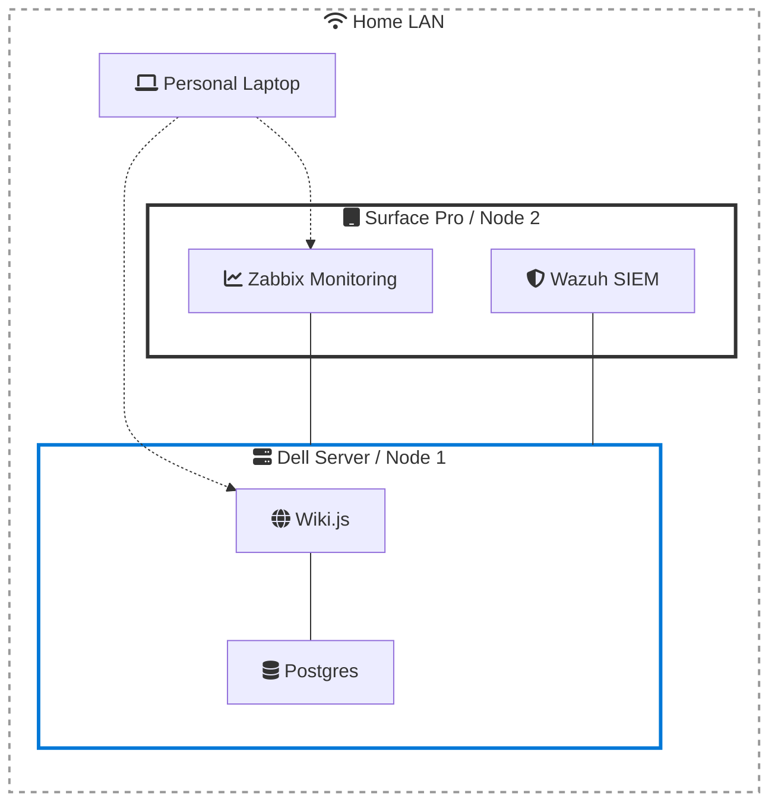

# Promox Self-Host
Converting existing hardware into a Proxmox server to host a LAN available Wiki.js instance and PostgresSQL DB using containers and networking basics.

# Stack

# Stack

| **Virtualization** | **Infrastructure** | **Application** | **Database** | **Monitoring** | **Security** | **Versioning** |
| :---: | :---: | :---: | :---: | :---: | :---: | :---: |
|  |  |  |  |  |    |  |
| **Proxmox VE** | **Debian/LXC** | **Wiki.js** | **PostgreSQL** | **Zabbix** | **Wazuh** | **GitHub** |

# Architecture

